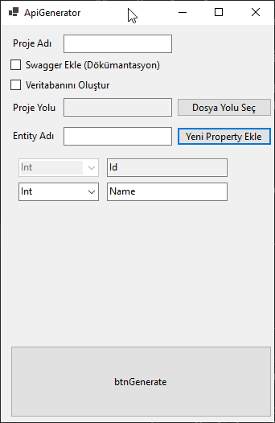
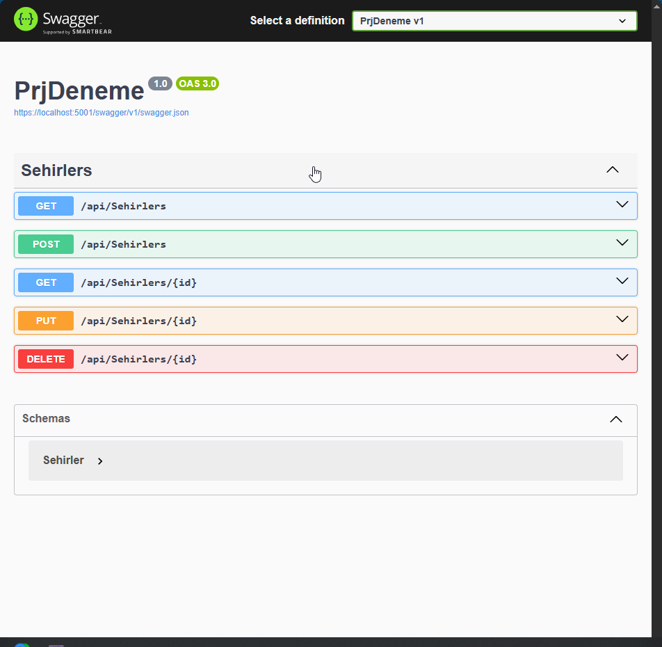

# 🚀 Web API Generator

## 👥 Hazırlayanlar

| Ad Soyad | Öğrenci No | Şube |
| :--- | :--- | :--- |
| **Ömer Karaman** | 235260301 | İkinci Öğretim |
| **Sueda Onur** | 230260145 | Örgün Öğretim |

---

## 📝 Proje Hakkında
Bu proje, **BMÜ401-Bilgisayar Mühendisliği Tasarım Dersi** kapsamında geliştirilmiştir. Temel amacı, .NET tabanlı Web API geliştirme süreçlerinde tekrar eden mimari kurulumları, veritabanı yapılandırmalarını ve paket yönetimini otonom hale getirerek geliştiriciye **"Zero-Configuration"** (Sıfır Yapılandırma) deneyimi sunmaktır.

### 🛠 Problemin Tanımı
Yeni bir API projesine başlarken; DbContext yapılandırması, Generic Repository pattern kurulumu, Unit of Work tasarımı ve Dependency Injection kayıtları yaklaşık 1-2 saatlik manuel iş gücü gerektirir. **Web API Generator**, bu süreci **saniyelere indirerek** hata payını sıfırlar ve kurumsal standartlarda bir mimari sağlar.

---
## 📦 Kurulum ve Kullanım
1. Bilgisayarınızda **.NET 9 SDK** yüklü olduğundan emin olun.
2. EF Core araçları için terminale şu komutu yazın: 
   `dotnet tool install --global dotnet-ef`
3. Uygulamayı çalıştırın, Proje adını ve Entity özelliklerini girin.
4. **"Auto Migrate"** ve **"Include Swagger"** seçeneklerini işaretleyerek **"Generate"** butonuna basın.
5. Onay verdikten sonra tarayıcınızda açılan Swagger arayüzü üzerinden API'nizi hemen test etmeye başlayın!

---

## 🎯 Temel Özellikler
Proje, klasik kod üretiminin ötesinde tam bir otomasyon döngüsü sunar:

* **Dinamik Proje Başlatma:** .NET CLI entegrasyonu ile fiziksel klasör yapısı ve `.csproj` dosyalarının gerçek zamanlı kurulumu.
    * **Generic Repository Pattern** & **Unit of Work** (RepositoryManager) entegrasyonu.
    * **Lazy Loading** destekli repository servisleri.
* **Tam Otonom Veritabanı (Auto-Migrate):**
    * Entity yapısına göre otomatik **Migration** dosyalarının üretilmesi.
    * SQL Server üzerinde veritabanı ve tabloların CLI üzerinden fiziksel inşası.
* **Akıllı Yapılandırma:**
    * **Swagger:** İsteğe bağlı entegrasyon ve otomatik middleware yapılandırması.
    * **LaunchSettings:** Projenin belirlenen portta (localhost:5001/swagger) otomatik tetiklenmesi.

---

## ⚙️ Teknik Mimari
Üretilen projeler kurumsal standartlara uygun katmanlı bir yapıda inşa edilir:
* **Data Layer:** EF Core tabanlı `AppDbContext` ve Connection String yönetimi.
* **Repository Layer:** `IGenericRepository` arayüzü ve merkezi `RepositoryManager`.
* **Presentation Layer:** Standart CRUD operasyonlarını içeren hazır `Controller` sınıfları.

---
## 📸 Uygulama Ekran Görüntüsü

---

## 💻 Kullanılan Teknolojiler
* **Framework:** .NET 9.0 (Web API)
* **ORM:** Entity Framework Core (SQL Server)
* **Tools:** .NET CLI, EF Core Tools (Design & SqlServer)
* **UI:** Windows Forms (Generator Controller)
* **Language:** C#

---

